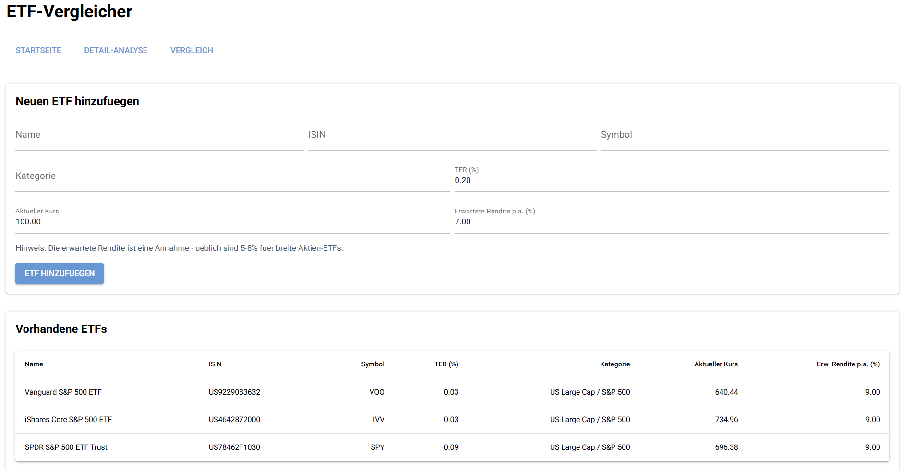
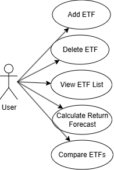
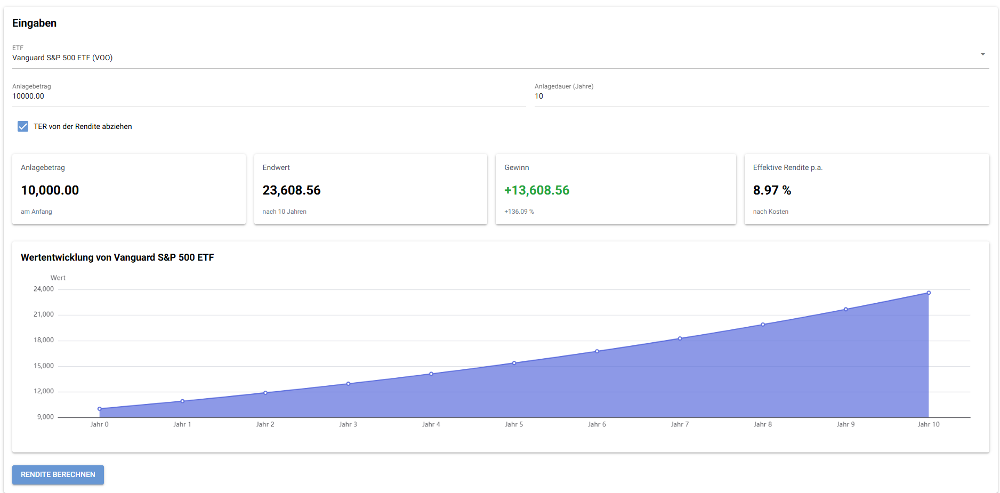
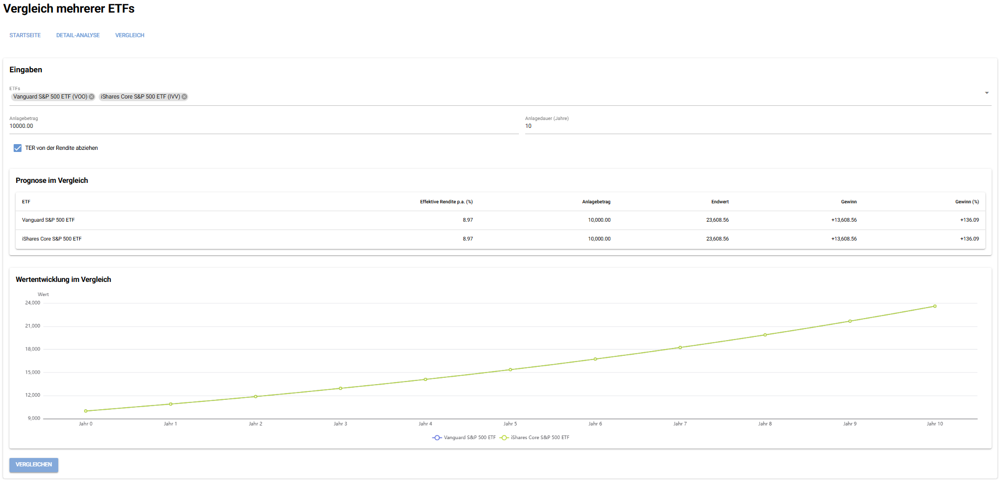
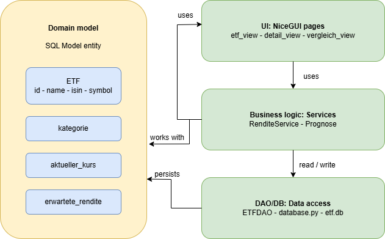
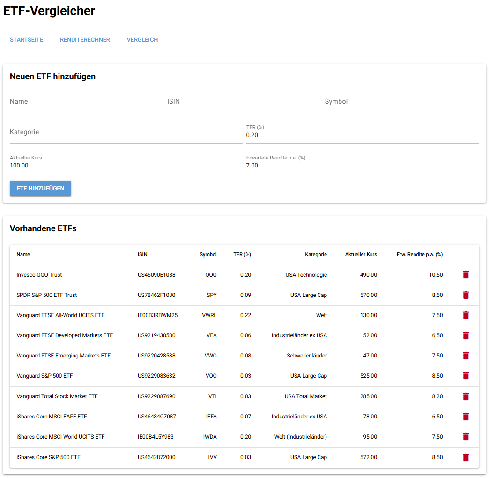
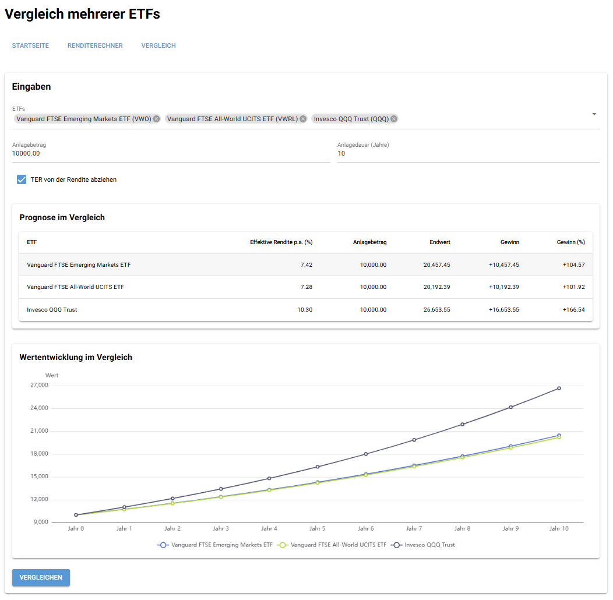

# 📈 ETF-Vergleicher – ETF Comparison Web App



---

This project demonstrates the development of a browser-based application using **NiceGUI**, focusing on clean architecture, data validation, and database integration via an ORM.

It aims to:

- Cover the full process from **requirements analysis to implementation**
- Apply advanced **Python** concepts in a web-based application
- Demonstrate **data validation**, layered architecture, and ORM usage
- Produce clean, maintainable, and well-tested code
- Support **teamwork and professional documentation**

---

## 📝 Application Requirements

### Problem

Private investors often lack simple tools to compare ETFs and project their future performance. Decisions are made based on gut feeling, without accounting for costs such as TER or the effect of compound interest over time.

---

### Scenario

The application allows users to:
- manage a personal list of ETFs (add / delete)
- view key ETF data in a clear overview table
- calculate a return forecast for a selected ETF (compound interest formula)
- compare multiple ETFs side by side in a table and chart
- validate all inputs before processing

---

## 📖 User Stories

### 1. Manage ETF List
**As a user, I want to add new ETFs and view or delete existing ones.**

- **Inputs:** name, ISIN, symbol, TER, category, current price, expected annual return
- **Outputs:** updated ETF list (`list[ETF]`)

---

### 2. View ETF Overview
**As a user, I want to see all saved ETFs in a clear table.**

- **Inputs:** none
- **Outputs:** table with all ETF data

---

### 3. Return Forecast (Detail View)
**As a user, I want to calculate the expected growth of a one-time investment in a selected ETF.**

- **Inputs:** ETF selection, investment amount (`float`), investment duration (`int`), TER deduction (`bool`)
- **Outputs:** final value, profit, effective return p.a., chart of annual values

---

### 4. ETF Comparison
**As a user, I want to compare multiple ETFs side by side.**

- **Inputs:** multiple ETF selection, investment amount (`float`), investment duration (`int`), TER deduction (`bool`)
- **Outputs:** comparison table and multi-line chart

---

## 🧩 Use Cases



### Main Use Cases
- Add ETF (User)
- Delete ETF (User)
- View ETF List (User)
- Calculate Return Forecast (User)
- Compare ETFs (User)

### Actors
- User

---

### Wireframes / Mockups

> 🚧 Add screenshots of the wireframe mockups you chose to implement.





---

## 🏛️ Architecture



### Layers
- **UI:** NiceGUI (browser-based interface)
- **Application logic:** services
- **Persistence:** SQLite + ORM + data access (DAO)

### Design Decisions
- MVC structure (Model–View–Controller)
- Clear separation of concerns
- Business logic independent of UI

### Design Patterns Used
- **Model-View-Controller / Layered MVC Variant:** MVC makes sense here because the application has a graphical user interface, user interactions, business objects, and database access. Separating these responsibilities makes the project easier to understand, test, and extend.
- **Facade Pattern:** The `database.py` module acts as a facade: it hides the technical details of engine creation, table generation, and session management from the rest of the application.
- **Data Access Object (DAO):** `ETFDAO` encapsulates all database operations for ETFs. The rest of the application only calls methods like `create()` or `get_all()` without needing to know any SQL or session logic.

---

## 🗄️ Database and ORM


The application uses **SQLModel** to map domain objects to a SQLite database (`etf.db`).

### Entities
- `ETF`

### Fields
| Field | Type | Description |
|---|---|---|
| `id` | `int` | Primary key (auto-generated) |
| `name` | `str` | Full name of the ETF |
| `isin` | `str` | Unique ISIN identifier |
| `symbol` | `str` | Ticker symbol (e.g. `VWRL`) |
| `ter` | `float` | Total Expense Ratio in % |
| `kategorie` | `str` | Category (e.g. `Welt`, `Schwellenländer`) |
| `aktueller_kurs` | `float` | Current price in CHF/EUR/USD |
| `erwartete_rendite` | `float` | Expected annual return in % |

---

## ✅ Project Requirements

> 🚧 Requirements act as a contract: implement and demonstrate each point below.

Each app must meet the following criteria in order to be accepted (see also the official project guidelines PDF on Moodle):

1. Using NiceGUI for building an interactive web app
2. Data validation in the app
3. Using an ORM for database management

---

### 1. Browser-based App (NiceGUI)

The application runs entirely in the browser via NiceGUI. Users can:

- Add and view ETFs on the start page
- Perform detailed return calculations on the detail page
- Compare multiple ETFs with a table and chart on the comparison page

**Architecture note (per SS26 guidelines):** the browser is a thin client; UI state + business logic live on the server-side NiceGUI app.

---

### 2. Data Validation

The application validates all user inputs:

- All text fields (name, ISIN, symbol, category) must be filled before saving
- Current price must be greater than 0
- Investment amount must be greater than 0
- Investment duration must be at least 1 year
- Duplicate ISINs are rejected with a warning message
- At least 2 ETFs must be selected for comparison

These checks prevent crashes and guide the user toward correct input, matching the validation requirements described in the project guidelines.

---

### 3. Database Management

All ETF data is stored and managed via **SQLModel** (an ORM based on SQLAlchemy). The `ETFDAO` class handles all CRUD operations; the rest of the application never writes raw SQL.

---

## ⚙️ Implementation

### Technology

- Python 3.x
- NiceGUI
- SQLModel / SQLAlchemy
- pytest

---

### 📚 Libraries Used

- **nicegui** – UI framework
- **sqlmodel** – ORM
- **sqlalchemy** – database toolkit
- **pytest** – testing
- **pytest-cov** – coverage

---

## 📂 Repository Structure

```text
etf_app/
├── __init__.py
├── main.py
├── database.py
├── models.py
├── dao/
│   ├── __init__.py
│   └── etf_dao.py
├── services/
│   ├── __init__.py
│   └── rendite_service.py
└── views/
    ├── __init__.py
    ├── etf_view.py
    ├── detail_view.py
    └── vergleich_view.py
```

---

### How to Run

### 1. Project Setup
- Python 3.13 (or the course version) is required
- Create and activate a virtual environment:
   - **macOS/Linux:**
      ```bash
      python3 -m venv .venv
      source .venv/bin/activate
      ```
   - **Windows:**
      ```bash
      python -m venv .venv
      .venv\Scripts\Activate
      ```
- Install dependencies:
   ```bash
   pip install -r requirements.txt
   ```

### 2. Configuration
- No additional configuration is required. The SQLite database file (`etf.db`) is created automatically on first launch.

### 3. Launch
- Start the NiceGUI app:
   ```bash
   python main.py
   ```
- Open the URL printed in the console (default: `http://localhost:8080`).

### 4. Usage

**Add an ETF:**
1. Open the start page.
2. Fill in all fields (name, ISIN, symbol, TER, category, current price, expected return).
3. Click **ETF hinzufügen** – the ETF appears in the table below.

**Calculate a forecast:**
1. Navigate to **Detail-Analyse**.
2. Select an ETF, enter an investment amount and duration.
3. Optionally enable/disable TER deduction.
4. Click **Rendite berechnen** – results and a chart are displayed.

**Compare ETFs:**
1. Navigate to **Vergleich**.
2. Select at least 2 ETFs, enter an investment amount and duration.
3. Click **Vergleichen** – a comparison table and multi-line chart are displayed.

> 🚧 Add UI screenshots of the main screens (or a short video link):





---

## 🧪 Testing

> 🚧 Explain what you test and how to run tests.

**Test mix:**
- Overall 12 tests
- 6 Unit tests: e.g. return calculation with TER deduction, return calculation without TER, zero profit at 0% effective return, `Prognose` dataclass field values, negative effective return, single-year forecast
- 3 DB tests: e.g. `get_all()` returns seeded ETFs, `create()` persists a new ETF, `get_by_isin()` finds the correct record
- 3 Integration tests: e.g. adding an ETF via the DAO and verifying it appears in `get_all()`, duplicate ISIN is rejected, forecast calculation with a real DB-loaded ETF

**Run tests:**
```bash
pytest --cov
```

**Template for writing test cases:**
1. Test case ID – unique identifier (e.g., TC_001)
2. Test case title/description – What is the test about?
3. Preconditions: Requirements before executing the test
4. Test steps: Actions to perform
5. Test data/input
6. Expected result
7. Actual result
8. Status – pass or fail
9. Comments – Additional notes or defect found

---

## 👥 Team & Contributions

> 🚧 Fill in the names of all team members and describe their individual contributions below.

| Name | Contribution |
|---|---|
| Student A | NiceGUI UI + documentation |
| Student B | Database & ORM + documentation |
| Student C | Business logic + documentation |

---

## 📝 License

This project is provided for **educational use only** as part of the Advanced Programming module.

[MIT License](LICENSE)
